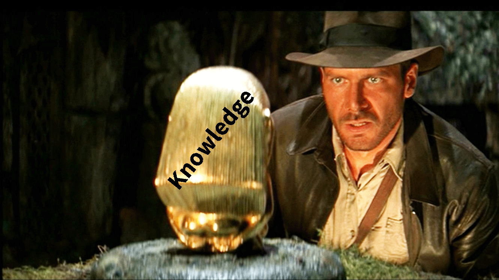
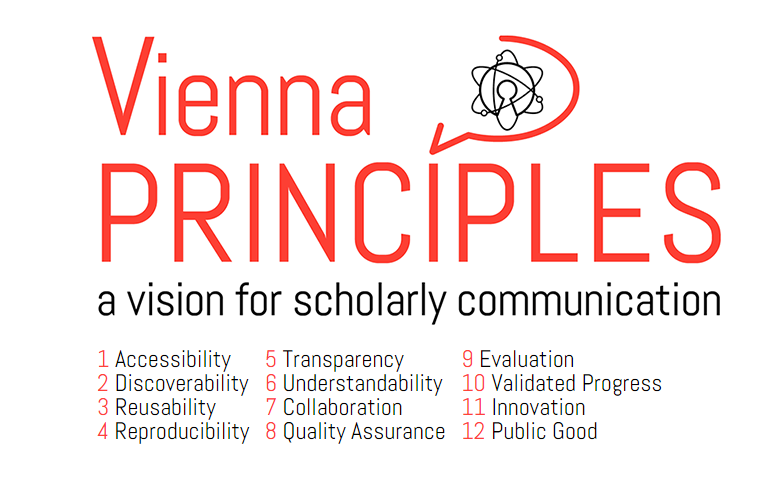
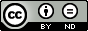
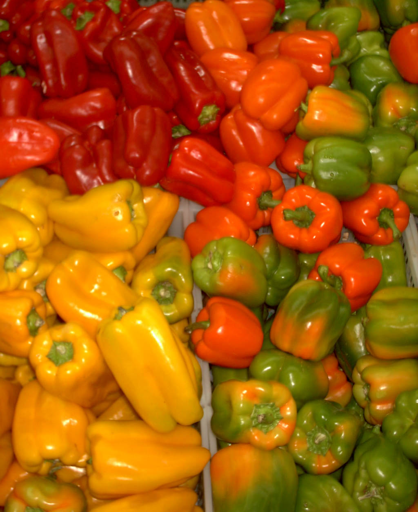

# Raiders of the lost work
*Open Science Workshop at the [MEi:CogSci Conference 2016](http://www.univie.ac.at/meicogsci/php/ocs/index.php/meicog/meicog2016/schedConf/overview)*

**The natural habitat of knowledge is the public and that’s exactly the place where we want to release scholarly works.**

In this workshop we will liberate forgotten seminar papers and theses that are gathering dust on hard drives and make them openly accessible. For this purpose we will give a brief introduction to Open Science and Copyright law. The practical part will consist of converting the papers into an open format, choosing and applying an open license and finally uploading them to an open repository for MEi:CogSci (https://zenodo.org/collection/user-meicogsci).

Sharing students' fruit of labor is not only a way of giving a stage to them and other early career researchers, but also represents science as an inclusive community that embraces openness and its role in society.

+ Date: 25. June 2016, 14:30 - 15:30
+ Where: [MEi:CogSci Conference 2016](http://www.univie.ac.at/meicogsci/php/ocs/index.php/meicog/meicog2016/schedConf/overview), New Institue Building (NIG), HSII
+ Who: Asura Enkhbayar ([Email](asura.enkhbayar@gmail.com), [Twitter](https://twitter.com/AsuraEnkhbayar), [GitHub](https://github.com/Bubblbu))
+ Material available on [GitHub](https://github.com/Bubblbu/raiders-of-the-lost-work)

This workshop is based on the workshop "Tag der Befreiung der verlorenen Seminararbeiten" which was organised by [Open Knowledge Austria](okfn.at). It was part of the [Open Science Lecture Series](http://openscienceasap.org/education/courses/open-science-lecture-series-wtz-ost/).

### Copyright

This work is licensed under a [Creative Commons Attribution 4.0 International License](http://creativecommons.org/licenses/by/4.0/).

## Table of Contents

<!-- MarkdownTOC -->

- [Introduction](#introduction)
	- [Why this workshop?](#why-this-workshop)
	- [Preparation](#preparation)
- [Open Science](#open-science)
	- [The movement](#the-movement)
	- [The idea](#the-idea)
	- [Why Open Science?](#why-open-science)
- [Copyright](#copyright)
	- [Open Licenses](#open-licenses)
	- [Guideline to find & use free material](#guideline-to-find--use-free-material)
	- [Common mistakes](#common-mistakes)
- [Raiding the lost knowledge](#raiding-the-lost-knowledge)
	- [Convert your paper](#convert-your-paper)
	- [Free your paper](#free-your-paper)
	- [Upload your paper](#upload-your-paper)
	- [Disseminate your paper](#disseminate-your-paper)

<!-- /MarkdownTOC -->

## Introduction

### Why this workshop?

### Preparation

+ Install [LibreOffice](https://www.libreoffice.org/)
+ Create a [Zenodo](zenodo.org) account

## Open Science

### The movement

Open Science aims to make knowledge and science accessible, usable, reusable and sharable for everybody.

The [Open Definition](http://opendefinition.org/):

> Open means anyone can freely access, use, modify, and share for any purpose (subject, at most, to requirements that preserve provenance and openness).

Open Science Principles by Andreas E. Neuhold - Own work, CC BY 3.0, [https://commons.wikimedia.org/w/index.php?curid=33542838](https://commons.wikimedia.org/w/index.php?curid=33542838)

### The idea

Open Science comprises multiple aspects (as in [P. Kraker, 2011: The case for an open science in technology enhanced
learning](www.know-center.tugraz.at/download_extern/papers/open_science.pdf)).

In this workshop we will address:

* **Open Source** and **Open file formats**: Offene Dateiformate erleichtern den Austausch zwischen verschiedenen Plattformen (Betriebssysteme, Programme). Das machen wir im Teil *[Seminararbeit konvertieren)(#seminararbeit-konvertieren)*.
* **Open Data**: Daten die im Zuge wissenschaftlicher Projekte erhoben werden sind ein wichtiger Forschungsbeitrag und verdienen mehr Aufmerksamkeit, welche sie als Open Data leichter erlangen. Daten offen zur Verfügung zu stellen ist auch wichtig um Forschung reproduzierbar zu machen. Wir können in diesem Workshop auch von euch gesammelte Daten hochladen, aus Datenschutzgründen erfordern diese aber gesonderte Aufmerksamkeit.
* **Open Access**: Der Zugang zu den Ergebnissen von Wissenschaft sollte allen gleichermaßen offen stehen. Open Access bedeutet uneingeschränkten Zugang zu, aber auch das Recht auf Weiterverwendung und Weiterverbreitung von Werken. Dies wird ermöglich durch Creative Commons Lizenzen, die wir im Teil [Urheber_innenrecht](#urheber_innenrecht) genauer besprechen.

### Why Open Science?

Open Science

* leads to more visibility, thus more citations
* enables reproducability of research
* reduces redundancy

**The Vienna Principles**

[The Vienna Principles](viennaprinciples.org)

## Copyright

> Copyright is a legal right created by the law of a country ([Austrian copyright law](https://de.wikipedia.org/wiki/Urheberrecht_(%C3%96sterreich))) that grants the creator of an original work exclusive rights for its use and distribution. 

Let's have a look at [Creative Commons](https://creativecommons.org/).

### Open Licenses

[Open Definition](http://opendefinition.org/): Open data and content can be freely used, modified, and shared by anyone for any purpose.

> “Open means anyone can freely access, use, modify, and share for any purpose (subject, at most, to requirements that preserve provenance and openness).”

The Open Definition is not a license, but certain existing copyright licenses are compatible with the definition.
[Creative Commons](https://creativecommons.org/) provide easy-to-use copyright licenses.

Some are **compatible with the Open Definition**:

- [Creative Commons Attribution](https://creativecommons.org/licenses/by/4.0/):	CC BY, you only need to accredit the original creator.

	

- [Creative Commons Attribution-ShareAlike](https://creativecommons.org/licenses/by-sa/4.0/) CC BY-SA, additionally to attribution the new creation needs to be licensed under identical terms. (potential to go viral)

	

- [Creative Commons Zero](https://creativecommons.org/about/cc0/): CC0 (Public Domain) all copyrights and related or neighboring rights over the work are waived, at least as far as the the legal framework allows you to.

	 

**Incompatible CC licenses**:

- [Creative Commons Attribution-NonCommercial](https://creativecommons.org/licenses/by-nc/4.0/): (CC BY-NC), weil dadurch nicht alle das Werk nutzen dürfen. Ein großes Problem der non-commercial Klausel ist auch, das dies noch nie durchjudiziert worden ist und der Begriff nicht-kommerziell rechtlich sehr schwammig ist. Dies kann auch so ausgelegt werden, dass alle Organisationen, die Umsätze generieren, das Werk nicht verwenden können. Dies trifft oftmals auf Organisationen die man dabei gar nicht im Auge hat, wie zum Beispiel die Wikipedia, Zeitungen oder andere Open Projekte.

	 

- [Creative Commons Attribution-NoDerivs](https://creativecommons.org/licenses/by-nd/4.0/): (CC BY-ND), weil das Verändern des Werkes nicht erlaubt ist.

	 

**Important**

- choose an open licencse
- you need to be the author of the *whole (!) creation* (except the usage of other freely usable work)
- *Trademarks*: Copyright law usually does not apply to logos of companies, but trademarks need to be considered 
- *Personality rights*: Be careful when using photos with close shots of a person.
- Text: *Citing is allowed*
- Tables: Collected and aggregated by yourself. *Data privacy*!

**Examples for CC license text**

Full text:

> This work is licensed under a [Creative Commons Attribution 4.0 International License](http://creativecommons.org/licenses/by/4.0/).

Shortcode:

> CC BY 4.0

### Guideline to find & use free material

#### Find the material

To find works that you are allowed to use, it is recommended to use known sources for free material such as [Wikipedia](https://wikipedia.org/)) or search engines, with the option to filter by usage rights (Google Images: Search Tools → Usage rights → *Labeled for reuse with modification*, [Creative Commons Suche](https://search.creativecommons.org/)).

*Important* Most of the content on the internet and in science does not, so be careful.

#### Check the material

If the work has a more restrictive open license, you are still allowed to use the work, but need to explicitly denote the more resctrictive lixense.

Example:

A CC BY work may contain CC BY-SA images, but this has to be stated excplicitely and clearly.

#### Use the material

The Creative Commons licences are translated to domestic law, as can be seen in the case of Austrian CC liceneses ([CreativeCommons.at](http://creativecommons.at)).

*Thus it is recommended to use the International, Generic or Unported version of CC licenses, as these are the standard-licenses and starting points for national licences.

Once you have found a piece that you would like to use, you have to clearly state:
+ the author of the creation
+ the title of the creation
+ and the license

**Attribution**

There is no guideline for attribution of a work, but a very common way of attribution is:

> TITLE by AUTHOR (LICENSE)

Example image [Capsicum Chili on Wikipedia](https://commons.wikimedia.org/wiki/File:Capsicum1.jpg):

[Capsicum Chili](https://de.wikipedia.org/wiki/Benutzer:Togo) by [Togo](https://de.wikipedia.org/wiki/Benutzer:Togo) ([CC BY-SA](https://creativecommons.org/licenses/by-sa/3.0))

You can also add (usually in the case of HTML publications):

+ [Link](https://de.wikipedia.org/wiki/Benutzer:Togo) to the author
+ [Link](https://commons.wikimedia.org/wiki/File:Capsicum1.jpg) to material
+ [Link](https://creativecommons.org/licenses/by-sa/3.0/deed.en) to license
+ add [Creative Commons Icon](https://licensebuttons.net/) and link
+ License version
+ legal implementation (International, DE, AT, etc.)

### Common mistakes

The most common mistake is the usage of images, which you haven't created or don't own the rights for. As in the case of social platforms (e.g. Facebook), most illustrations, scans, photos and infrographics in scientific works are usually not legally acquired.

## Raiding the lost knowledge

Before we can release our works into the wild, we need to make it fit and suitable for this environment. In this part of the workshop we will fullfill these technical requirements. 

### Convert your paper

1. Choose your work:
	+ Formats: Seminar works, Bachelor- or Master theses or other academic texts. (ideally ~1-20 pages)
	+ Importat:
		+ Authorship (no copy & paste)
		+ Images (illustrations) created by yourself, heed personality right
		+ Tables: if data is entered, ensure author rights or full right of use 
2. Convert documents to a [open format](https://de.wikipedia.org/wiki/Offenes_Format)
	+ OpenDocument (.odt, .ods, .odp,...)
		+ Export as OpenDocument from proprietary software
		+ Use LibreOffice or OpenOffice
		+ Copy & paste into LibreOffice
	+ Latex
	+ HTML
3. Check layout

### Free your paper

[Creative Commons License Chooser](https://creativecommons.org/choose/) is a tool that helps you to choose the appropiate license for your work.
We recommend [Creative Commons Attribution 4.0](https://creativecommons.org/licenses/by/4.0/) as the standard license. There are no conditions, but clear attribution.

Add this paragraph to the end of your work just before the references:

> This work is licensed under a [Creative Commons Attribution 4.0 International License](http://creativecommons.org/licenses/by/4.0/).

Ideally you add a section title "Copyright" and the respective [CC BY Logo](https://licensebuttons.net/l/by/4.0/88x31.png).

### Upload your paper

Our paper is ready to roam in the wild, but is still only available to a very limited audience. As we already said, the public is the natural habitat of knowledge, thus we will now choose an open repository and make the work available to everybody.

#### Zenodo

[Zenodo](https://zenodo.org/) is an open repository for scientific content. It is developed by [CERN](cern.ch) under the EU PB7 project [OpenAIREplus](openaire.eu).

**Why Zenodo?**

* Dissemination of the work because of public access and availability of data
* long-term storage (CERN cloud server) of content and public interest in continuation of this project (OpenAIRE)
* increased findability/distinction and easier to cite **[DOI](https://en.wikipedia.org/wiki/Digital_object_identifier)**

*Important* Community specific repositories, archives and preprint servers are also very good options to upload your work. (e.g. [arXiv](arxiv.org), [bioRxiv](http://biorxiv.org/))

In the case of Cognitive Science: **[CogPrints](cogprints.org)**

**Final step-by-step guide**

* Create a Zenodo account: Basically you only need an email address. But you can also use a [GitHub-Account](http://github.com/) or your [ORCID](http://orcid.org/)
* The freed paper is ready: This is legally one of the most important points. It is possible to request the deletion of a Zenodo upload, but this is a manually moderated process. Thus it is strongly recommended to verify the integrity (see [Copyright](#copyright)).
* Upload the freed paper and add [Metadata](https://en.wikipedia.org/wiki/Metadata): Names of authors, date of publications, keywords und license...

### Disseminate your paper

> If a tree falls in a forest and no one is around to hear it, does it make a sound?

so...

> If a MEI:CogSci paper is uploaded to Zenodo and nobody knows of it, does it have an impact?

+ [WordPress](https://wordpress.com/): Blogging Platform
+ [Twitter](http://twitter.com/): Micro-blogging Plattform
+ [Slideshare](http://slideshare.net/): Platfrom to upload and share presentations
+ Acedemic Social Networks (e.g. [ResearchGate](https://www.academia.edu/), [Academia](https://www.academia.edu/))